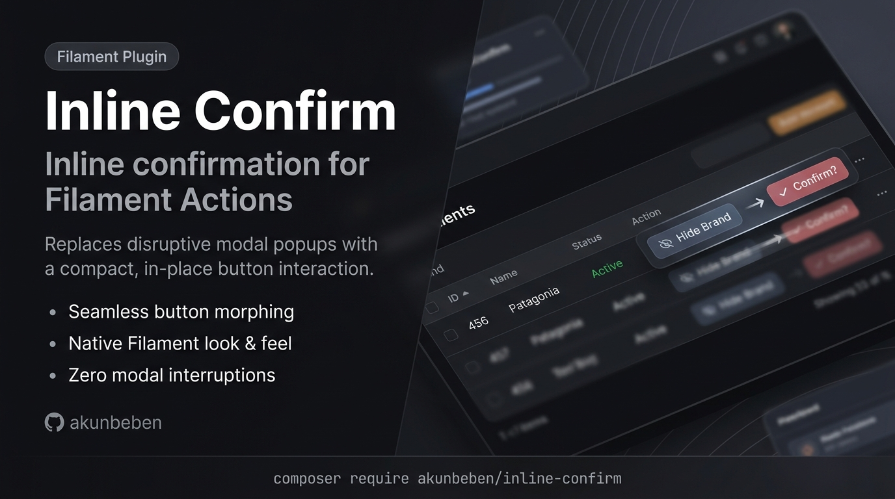

# Inline confirmation for Filament Actions



Inline confirmation for selected Filament actions. The plugin replaces modal confirmation with a compact in-place confirmation interaction for actions that explicitly opt in.

## Installation

You can install the package via composer:

```bash
composer require akunbeben/inline-confirm
```

Register the plugin in your Filament panel:

```php
use Akunbeben\InlineConfirm\InlineConfirmPlugin;

$panel
    ->plugin(InlineConfirmPlugin::make());
```

## Usage

Opt in per action:

```php
use Filament\Actions\Action;

Action::make('deactivate')
    ->requiresConfirmation()
    ->inlineConfirmation();
```

`inlineConfirmation()` only changes how confirmation is presented. It does not imply `requiresConfirmation()`, so both methods are required.

Custom confirmation label and timeout:

```php
use Filament\Actions\Action;

Action::make('deactivate')
    ->requiresConfirmation()
    ->modalSubmitActionLabel('Confirm')
    ->inlineConfirmation(timeout: 3000);
```

### Inside an ActionGroup

Actions inside dropdown menus and button groups are also supported:

```php
use Filament\Actions\Action;
use Filament\Actions\ActionGroup;

ActionGroup::make([
    Action::make('edit')->label('Edit'),
    Action::make('delete')
        ->label('Delete')
        ->color('danger')
        ->requiresConfirmation()
        ->inlineConfirmation(),
]);
```

When the user clicks a grouped action with inline confirmation, the dropdown stays open to show the confirmation state. On confirm, the action executes and the dropdown closes.

## Limitations

Only confirmation-only actions are rendered inline. Actions with forms, schemas, custom modal content, custom modal footer content, URL behavior, or submit behavior fall back to Filament's default modal behavior.

## Testing

```bash
composer test
```

## Changelog

Please see [CHANGELOG](CHANGELOG.md) for more information on what has changed recently.

## Contributing

Please see [CONTRIBUTING](.github/CONTRIBUTING.md) for details.

## Security Vulnerabilities

Please review [our security policy](.github/SECURITY.md) on how to report security vulnerabilities.

## Credits

- [Benny Rahmat](https://github.com/akunbeben)
- [All Contributors](https://github.com/akunbeben/inline-confirm/graphs/contributors)

## License

The MIT License (MIT). Please see [License File](LICENSE.md) for more information.
